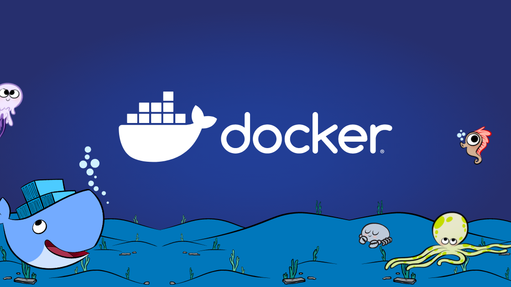

import imageAbdullahMujahid from '@/images/team/abdullah-mujahid.jpg'

export const article = {
  date: '2024-09-04',
  title: 'Docker 101: From Tugboat to Container Ship',
  description:
    'A comprehensive guide to understanding Docker containerization, from basic concepts to practical implementation.',
  author: {
    name: 'Abdullah Mujahid',
    // role: 'Co-Founder / CTO',
    image: { src: imageAbdullahMujahid },
  },
}

export const metadata = {
  title: article.title,
  description: article.description,
}

# Docker 101: From Tugboat to Container Ship



Hello there👨! Ready to dive into the ocean of containerization? Well, grab your life jackets because we're about to set sail with Docker! 🚢

## What is Docker?

Docker is like a magical shipping container for your code. It packages up your application and all its dependencies into a standardized unit called a container. These containers are lightweight, portable, and can run anywhere from your laptop to a server in the cloud. It's like giving your app a cosy little house that it can take anywhere!

## Why should you give a dock about Docker?

- **Consistency**: "It works on my machine" is no longer an excuse. With Docker, if it works in your container, it'll work everywhere. It's like having a universal adapter for your code!
- **Isolation**: Each container is like its own little world. No more "stop hitting yourself" moments when one app interferes with another.
- **Efficiency**: Containers share the host system's kernel, making them lighter and faster than traditional VMs. It's like carpooling for your apps!
- **Scalability**: Need more power? Just spin up more containers. It's like cloning your app, minus the ethical dilemmas.

## Docker in Action: A Whale of a Tale

Let's say you have a simple Python web app. Here's how you might "Dockerize" it (i.e., prepare it to run in a Docker container):

```dockerfile
# Use an official Python runtime as a parent image
FROM python:3.9-slim

# Set the working directory in the container
WORKDIR /app

# Copy the current directory contents into the container at /app
COPY . /app

# Install any needed packages specified in requirements.txt
RUN pip install --no-cache-dir -r requirements.txt

# Make port 80 available to the world outside this container
EXPOSE 80

# Define environment variable
ENV NAME World

# Run app.py when the container launches
CMD ["python", "app.py"]
```

This Dockerfile is like a recipe for your container. It tells Docker:

1. Start with a Python image (it's like choosing your base ingredients)
2. Set up a workspace (preheating the oven)
3. Copy in your code (adding the secret sauce)
4. Install dependencies (mixing in the spices)
5. Open up a port (setting the table)
6. Run your app (serving the dish)

To build and run this container, you'd use:

```bash
docker build -t my-python-app .
docker run -p 4000:80 my-python-app
```

## Docker Compose: The orchestra conductor for your containers

But wait, there's more! Enter Docker Compose, the tool that helps you manage multi-container applications. It's like a party planner for your containers, making sure everyone shows up and plays nice together.

With a simple YAML file, you can define and run all the services your app needs:

```yaml
version: '3'
services:
  web:
    build: .
    ports:
      - '5000:5000'
  redis:
    image: 'redis:alpine'
```

This Docker Compose file is saying, "Hey, let's have a party with a web service and a Redis database. They'll be best friends!"

To start this multi-container shindig, just run:

```bash
docker-compose up
```

And boom! You've got a full application stack running faster than you can say "Containerize me, captain!"

## Conclusion

Docker has revolutionized how we develop, ship, and run applications. It's solved the age-old problem of "but it works on my machine" and made deploying applications smoother than a freshly waxed whale.

Docker can help you swim through the choppy seas of modern software development. It's time to quit wading in the shallow end and dive deep into the world of containerization!

Now go forth and containerize! And may the pods be ever in your favour! 🐳
