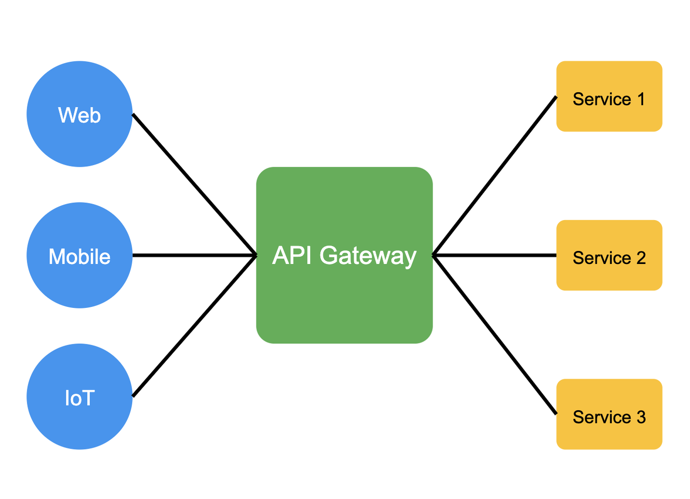

import imageAbdullahMujahid from '@/images/team/abdullah-mujahid.jpg'

export const article = {
  date: '2024-08-30',
  title: 'Understanding API Gateways: Your Digital Traffic Controller',
  description:
    'Discover how API gateways act as the central hub for modern applications, managing traffic, security, and communication between clients and services.',
  author: {
    name: 'Abdullah Mujahid',
    // role: 'Senior Software Engineer | Django, React, AWS',
    image: { src: imageAbdullahMujahid },
  },
}

export const metadata = {
  title: article.title,
  description: article.description,
}

# Understanding API Gateways: Your Digital Traffic Controller

**Picture this:** You're in a busy city, and there's a huge shopping mall with dozens of stores inside. Now, imagine if every store had its entrance from the street. Chaos, right? That's where a main entrance comes in handy — it manages the flow of people, provides security and helps you find your way around.

In the world of web services and applications, an API gateway plays a similar role. It's like that main entrance to our digital mall. Let's dive in and see what it's all about!

## What's an API Gateway?

An API gateway is a tool that sits between a client (like a mobile app or web browser) and a bunch of backend services. It acts as a reverse proxy, routing requests to the right services. But it's not just a simple router — it's got some tricks up its sleeve!

To help visualize this, consider an API gateway as a central hub:

- Clients (mobile apps, web browsers, IoT devices) connect to the gateway
- The gateway manages all incoming traffic
- Backend services receive properly routed and validated requests
- Everything flows through a single, managed point of entry

## Why Should You Care?

### 1. Simplifies Things

Instead of your app dealing with 10 different service endpoints, it just talks to one API gateway. Easy peasy!

### 2. Security Guard

It can check if you're allowed to enter (authentication) and what you're allowed to do once you're in (authorization).

### 3. Traffic Cop

It can manage and limit the number of requests, making sure no single client hogs all the resources.

### 4. Translator

It can convert between different protocols. Maybe your app speaks HTTP, but a backend service prefers gRPC. The gateway's got you covered.

### 5. Performance Booster

It can cache responses, so common requests get answered faster.

## A Day in the Life of an API Request

Let's walk through a simple example:

1. You open a shopping app on your phone
2. The app asks for the latest deals
3. This request hits the API gateway
4. The gateway checks if you're logged in
5. It then routes the request to the "Deals" service
6. The "Deals" service responds with the latest offers
7. The gateway might cache this response for future requests
8. Finally, it sends the deals back to your app

All this happens in the blink of an eye!

## Bottom Line

API gateways are the unsung heroes of our digital world, working tirelessly behind the scenes to make our online experiences smooth and secure. Just like that main entrance to our imaginary mall, they manage traffic, provide security, and keep things running efficiently. Whether you're a techy or just someone who loves using apps, understanding API gateways gives you a peek behind the curtain of modern technology.

Next time you effortlessly switch between apps or services, spare a thought for the API gateway — the digital doorkeeper making it all possible. In a world where our online lives are becoming increasingly complex, these clever tools are simplifying things one request at a time.
